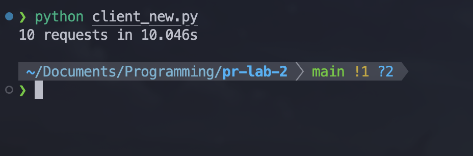
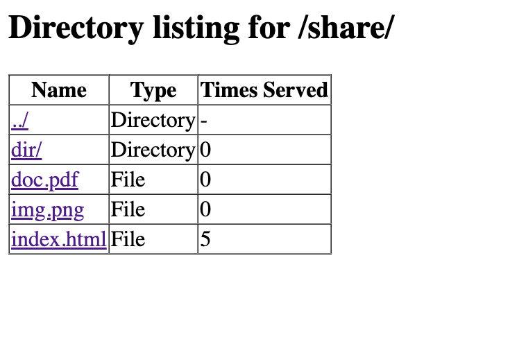

# Lab 1: HTTP File Server with TCP Sockets

### Course: PR

### Author: Rudenco Ivan

---

### Contents of the source directory


### Docker files
`Dockerfile`:
```
FROM python:3.11-slim

WORKDIR /app

COPY server.py .
COPY client.py .
COPY share ./share

EXPOSE 8080

CMD ["python", "-u", "server.py", "share"]
```
`docker-compose.yaml`:
```
services:
  file-server:
    build: .
    container_name: file_server
    ports:
      - "8080:8080"
    volumes:
      - ./share:/app/share
    restart: unless-stopped
  client:
    build:
      context: .
      dockerfile: Dockerfile
    container_name: http_client
    command: ["python", "-u", "client.py", "file-server", "8080", "/img.png", "/save"]
    volumes:
      - ./save:/save
    depends_on:
      - file-server
```

### Starting the container
Run `docker compose up -d --build`:


### Starting the server
Run `python server.py share`


### Contents of the served directory
- `dir`: nested folder for bonus task
- `index.html`
- `img.png`
- `doc.pdf`

### Requests of files in the browser
- Nonexistent file:

- HTML file with image:

- PDF file:

- PNG file:


### Client and saving files (bonus point)
Running the client:


`img.png` is saved into `save`:


### Directory listing (bonus point)
Directory listing:


Nested directory listing:
