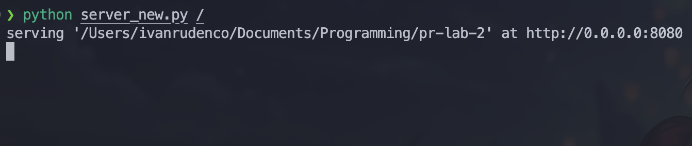
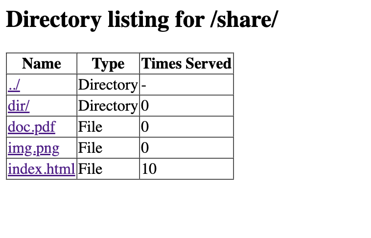

# Lab 2: Concurrent HTTP server

### Course: PR

### Author: Rudenco Ivan

---

### Docker files
`Dockerfile`:
```
FROM python:3.11-slim

WORKDIR /app

COPY server_new.py .
COPY client_new.py .
COPY share ./share

EXPOSE 8080

CMD ["python", "-u", "server_new.py", "/"]

```
`docker-compose.yaml`:
```
services:
  file-server:
    build: .
    container_name: file_server
    ports:
      - "8080:8080"
    volumes:
      - ./share:/app/share
    restart: unless-stopped
    networks:
      - internal_net

  client:
    build:
      context: .
      dockerfile: Dockerfile
    container_name: http_client
    command: ["python", "-u", "client_new.py"]
    depends_on:
      - file-server
    networks:
      - internal_net

networks:
  internal_net:
    driver: bridge

```

### Starting the container
Run `docker compose up -d --build`:


### Starting the server
Run `python server_new.py /`



### Client making 10 concurrent requests
Running the `client_new.py`:

- with multithreaded server:


- with singlethreaded server:


### Hit counter (bonus point)
1. In a naive way

    - before any requests are made, counter shows `0`:
    

    - run `client_new.py` to make `10` concurrent requests for `index.html`:
    

    - refresh the page to see updated counter. Counter shows `4`, even though `10` requests were made:
    

2. With thread lock mechanism

    - before any requests are made, counter shows `0`:
    

    - run `client_new.py` to make `10` concurrent requests for `index.html`:
    

    - refresh the page to see updated counter. Counter shows `10` as expected:
    

### Rate limiting by IP (bonus point)
The rate limit is set to 5 requests per second per IP.

- before any requests are made, counter shows `0`:


- run `client_new.py` to make `10` concurrent requests for `index.html`:


- refresh the page to see updated counter. Counter shows `5`, because only 5 requests were processed and the others were dropped:
